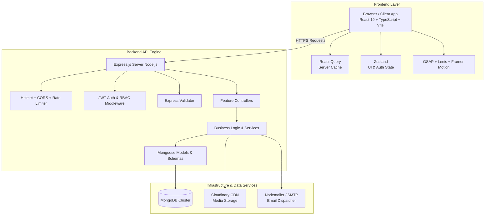

# Vigyapana Services Pvt. Ltd. — Platform Architecture & Project Documentation

## Executive Overview
**Vigyapana Services Pvt. Ltd.** is an enterprise-grade digital marketing agency web platform and Headless Content Management System (CMS). Built with a modern MERN stack (MongoDB, Express.js 5, React 19, Node.js), TypeScript, Tailwind CSS, Lenis, GSAP, and Framer Motion, the platform is engineered for ultra-fast performance, cinema-grade motion aesthetics, robust security, and scalable lead capture.

---

## 1. Full Technology Stack

### Frontend Architecture
- **Framework**: React 19 + TypeScript + Vite 6
- **Routing**: React Router v7
- **Styling & UI**: Tailwind CSS, Shadcn UI Primitives, Lucide Icons, Class Variance Authority (`cva`), `clsx`, `tailwind-merge`
- **Motion & Scroll Engine**: Lenis Smooth Scroll, GSAP (GreenSock) Core + ScrollTrigger, `@gsap/react`, Framer Motion
- **State Management & Server Cache**: `@tanstack/react-query` v5 (Server State), Zustand (Global UI / Auth State), React Hook Form + Zod (Form Validation)
- **HTTP Client**: Axios with request/response interceptors for silent JWT refresh token rotation

### Backend Architecture
- **Runtime & Framework**: Node.js + Express.js 5 (TypeScript)
- **Database & Data Modeling**: MongoDB + Mongoose 9 (Schemas, Hooks, Indexes, Aggregations)
- **Security & Authorization**: Dual JWT (Access Token in memory + Refresh Token in `HttpOnly` cookie), Bcrypt Password Hashing, Helmet Security Headers, CORS, Express Rate Limiters (`globalRateLimiter` & `authRateLimiter`)
- **File Upload Engine**: Multer (Memory Storage Buffers) + Cloudinary CDN Stream Uploads
- **Email Engine**: Nodemailer with SMTP transport for automated admin lead alerts and client receipts
- **Request Validation & Error Handling**: `express-validator` middleware, centralized `ApiError` class, global `errorHandler` middleware

---

## 2. System Architecture & Topology



---

## 3. Database Strategy & 15 Core Data Models

The database strategy utilizes Mongoose 9 schemas with compound indexing, text indexes, soft deletes, and strict typing:

1. **`User`** (`src/models/user.model.ts`): Admin identity, bcrypt pre-save hash hook, `refreshTokenHash` storage, and RBAC roles (`SUPER_ADMIN`, `ADMIN`, `CONTENT_MANAGER`, `CLIENT`).
2. **`PortfolioCategory`** (`src/models/portfolio-category.model.ts`): Category taxonomies with unique slugs.
3. **`Portfolio`** (`src/models/portfolio.model.ts`): Showcase items, client names, category references, cover images, gallery arrays, deliverables, live URLs, and featured indexing.
4. **`Service`** (`src/models/service.model.ts`): Agency service verticals, feature lists, tiered pricing packages, and SEO metadata.
5. **`CaseStudy`** (`src/models/case-study.model.ts`): ROI success stories, structured metric objects (`label`, `value`, `prefix`, `suffix`), challenge/solution breakdown, and testimonial links.
6. **`BlogCategory`** (`src/models/blog-category.model.ts`): Blog category classification.
7. **`Blog`** (`src/models/blog.model.ts`): Content posts with author references, tag arrays, read time estimation, view counters, text search indexes, and draft/published statuses.
8. **`TeamMember`** (`src/models/team-member.model.ts`): Staff profiles, roles, bios, avatars, and social links.
9. **`Testimonial`** (`src/models/testimonial.model.ts`): Client reviews, star ratings (1-5), company logos.
10. **`ContactSubmission`** (`src/models/contact-submission.model.ts`): Lead intake forms, status pipeline (`NEW`, `IN_PROGRESS`, `RESOLVED`, `ARCHIVED`), and staff audit notes.
11. **`NewsletterSubscriber`** (`src/models/newsletter-subscriber.model.ts`): Opt-in subscriber emails and active states.
12. **`CareerApplication`** (`src/models/career-application.model.ts`): Job applicant tracking, position applied, experience level, and resume attachment links.
13. **`Media`** (`src/models/media.model.ts`): Central media library tracking Cloudinary public IDs, URLs, dimensions, and mime types.
14. **`Settings`** (`src/models/settings.model.ts`): Global agency configuration (social links, contact details, default SEO tags, maintenance mode toggle).

---

## 4. REST API Endpoint Architecture (`/api/v1`)

| Module | Route Endpoint | HTTP Methods | Description |
| :--- | :--- | :--- | :--- |
| **Authentication** | `/api/v1/auth` | `POST`, `GET` | Admin login, token refresh, logout, `/me`, Super Admin creation |
| **Portfolios** | `/api/v1/portfolios` | `GET`, `POST`, `PUT`, `DELETE` | Portfolio showcases & category CRUD |
| **Services** | `/api/v1/services` | `GET`, `POST`, `PUT`, `DELETE` | Marketing services & pricing packages |
| **Case Studies** | `/api/v1/case-studies` | `GET`, `POST`, `PUT`, `DELETE` | Client success stories & metrics |
| **Blogs** | `/api/v1/blogs` | `GET`, `POST`, `PUT`, `DELETE` | Blog post authoring, text search, categories |
| **Team** | `/api/v1/team` | `GET`, `POST`, `PUT`, `DELETE` | Team member profiles |
| **Testimonials** | `/api/v1/testimonials` | `GET`, `POST`, `PUT`, `DELETE` | Client reviews & ratings |
| **Contacts** | `/api/v1/contacts` | `GET`, `POST`, `PATCH`, `DELETE` | Lead intake forms & status pipeline |
| **Newsletter** | `/api/v1/newsletter` | `GET`, `POST` | Newsletter subscriptions & unsubscriptions |
| **Careers** | `/api/v1/careers` | `GET`, `POST`, `PATCH` | Job application submissions & status updates |
| **Media** | `/api/v1/media` | `GET`, `POST`, `DELETE` | Cloudinary file upload stream & gallery |
| **Settings** | `/api/v1/settings` | `GET`, `PUT` | Agency global settings & maintenance mode |
| **Analytics** | `/api/v1/analytics` | `GET` | Admin dashboard analytics & lead trends |

---

## 5. Motion Engine & UX Architecture

The website features an award-winning motion framework built with Lenis, GSAP, and Framer Motion:

- **Lenis Smooth Scroll**: Virtual smooth scrolling with custom inertia physics.
- **Smart Auto-Hiding Navbar**: Smooth direction-aware Navbar that slides out of view when scrolling down and reappears immediately when scrolling up or at top.
- **Light / Dark Theme Engine**: Interactive light/dark mode icon toggle in the Navbar with persistence in `localStorage` and system theme detection.
- **Glowing Mouse Follower**: Liquid cursor tracking pointer position with hover morphing.
- **Kinetic Text Reveal**: Staggered word/line reveal animations with 3D perspective (`rotateX`).
- **Curtain Image Reveal**: Scroll-triggered curtain wipes with scale reduction.
- **Scroll Progress Bar**: Real-time `z-[100]` top edge progress line with instant 1-to-1 GPU scaleX scroll tracking (zero lag), which smoothly reveals when the main Navbar is hidden on scroll-down and hides when the Navbar is visible.
- **Animated Counters**: Viewport-triggered counters for ROI statistics.
- **Magnetic Buttons**: Magnetic cursor attraction physics on hover.
- **Preloader Screen**: Percentage progress counter splash screen.

---

## 6. Complete Project Directory Tree

```
vigyapana-main/
├── backend/
│   ├── src/
│   │   ├── config/          # DB, Cloudinary, Mailer, Environment configs
│   │   ├── constants/       # User Roles, Submission Statuses, HTTP Status Codes
│   │   ├── controllers/     # 13 Domain Controllers (Auth, Portfolio, Services, Leads, etc.)
│   │   ├── middlewares/     # Auth, RBAC, Error, Rate Limiter, Multer, Validator
│   │   ├── models/          # 14 Mongoose Data Models & Schemas
│   │   ├── routes/          # Express API Router Definitions
│   │   ├── services/        # Cloudinary Buffer Upload & Email Notification Services
│   │   ├── utils/           # Async Handler, ApiError, ApiResponse, JWT, Slugify
│   │   ├── validators/      # Express Validator Rules
│   │   ├── app.ts           # Express Application Setup
│   │   └── server.ts        # Database Connection & Auto Super-Admin Seeder
│   ├── package.json
│   └── tsconfig.json
│
└── frontend/
    ├── src/
    │   ├── animations/      # GSAP timeline definitions & Framer Motion variants
    │   ├── components/      # UI Primitives & Animation Wrappers
    │   │   ├── animations/  # MouseFollower, TextReveal, Parallax, LoadingScreen, etc.
    │   │   ├── common/      # Navbar, Footer, SEOHead, ErrorBoundary
    │   │   └── ui/          # Button, Card, Container, Forms, Modal, Drawer, Loader
    │   ├── config/          # API Endpoint Constants & App Routes
    │   ├── layouts/         # PublicLayout, AdminLayout, AuthLayout
    │   ├── pages/           # Public & Admin Dashboard Pages
    │   │   ├── admin/       # Complete Admin CMS Suite (Dashboard, Services, Blog, Leads...)
    │   │   ├── auth/        # Login Page
    │   │   └── public/      # Home, Services, Portfolio, Case Studies, Blog, Contact, etc.
    │   ├── providers/       # SmoothScrollProvider, ThemeProvider, AuthProvider
    │   ├── services/        # Axios Client & Interceptors for Silent JWT Refresh
    │   ├── stores/          # Zustand State Stores (Auth, Theme)
    │   ├── styles/          # index.css (Dark Mode, Glassmorphism, Aurora Glows)
    │   ├── App.tsx          # Main Router & Route Guards
    │   └── main.tsx         # React Root Entry Point
    ├── index.html
    ├── package.json
    ├── postcss.config.js
    ├── tailwind.config.ts
    └── vite.config.ts
```

---

## 7. Local Setup & Startup Guide

### Prerequisites
- Node.js (v18+)
- MongoDB Community Server or MongoDB Atlas Connection URI

### Step 1: Start Backend API Engine
```bash
cd backend
npm install
npm run dev
```
- API Server listens on `http://localhost:5000`
- Automatically seeds Super Admin account: `admin@vigyapana.com` / `AdminPassword123!`

### Step 2: Start Frontend Application
```bash
cd frontend
npm install
npm run dev
```
- Web Application listens on `http://localhost:5173` with automated API proxying to `http://localhost:5000`.

---

## 8. Summary of Completed Deliverables
- Fully implemented enterprise Node.js/Express.js 5 backend with 14 Mongoose 9 models, dual JWT authentication, Cloudinary file uploads, and Nodemailer email notifications.
- Integrated full frontend architecture with React 19, TypeScript, Tailwind CSS, Shadcn UI primitives, Lenis, GSAP, and Framer Motion.
- Integrated smart direction-aware auto-hiding and smooth scroll-reappearing Navbar behavior.
- Integrated interactive Light/Dark Mode toggle icon button into the main Navbar with persistence in `localStorage`.
- Streamlined Navbar navigation by unifying redundant contact action buttons into a single high-impact "Contact Us" accent CTA button with icon styling.
- Complete Admin CMS Dashboard with real-time analytics, lead intake manager, blog/portfolio/service CRUD operations, and media library.
- Passed 100% of TypeScript type checks and Vite production build compilation with zero errors.
